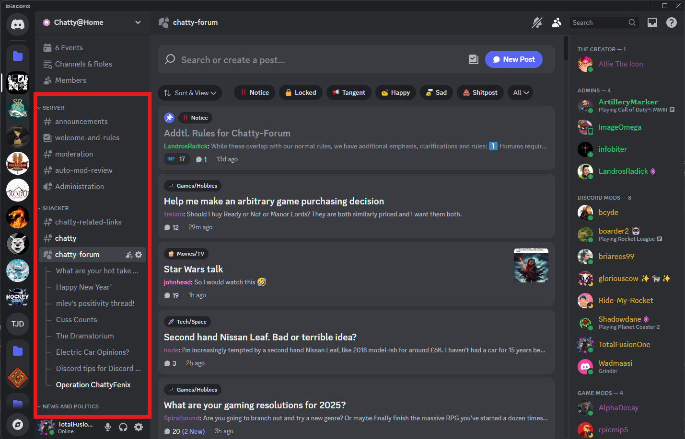

# Discord Transition Guide for [Your Forum Name] Members

## I. Introduction: Welcome to Discord!

### A. Bridging the Gap: Why Discord, and Why It Feels Different

The shift from the familiar threaded Chatty to Discord might feel a bit jarring at first. The Chatty was a place for static, organized discussion where conversations unfolded over time. Discord, on the other hand, is a more dynamic platform, originally designed for real-time communication among gamers. However, don't worry! Discord has evolved, and we can leverage a few of its features features to create a comfortable and engaging space that retains some of the best aspects of the chatty: Its community.

### B. Key Differences: Forum vs. Discord (High-Level)

Here's a quick rundown of some fundamental differences:

* **Real-time Chat vs. Threaded Posts:** Discord's core is real-time chat, which can feel faster-paced than our forum's slower, threaded discussions. However, Discord also offers features like **threads** and **slow mode** to manage the flow of conversation and create focused discussions, similar to forum threads. We'll be exploring these options later on in this guide.
* **Always-on Presence vs. Asynchronous Participation:** Discord shows who's currently online, fostering a sense of immediacy. On the forum, we were used to participating asynchronously, replying whenever we had time. On Discord, you can still participate at your own pace, but you'll also have the option to engage in live conversations. Managing your online status and notifications will be essential and learning how to adjust them to fit your wants is key to not getting annoyed at the format.
* **Notifications:** Discord's notifications can be much more frequent than anything we're used to with the Chatty. Any user can tag any other user and prompt a notification to show. Furthermore, you can have assigned roles that you always get prompted for such as the #StarCitizen or #Sports which can also prompt for a notification.

### C. This Guide's Goal

This guide aims to:

1. Help you maintain a sense of the chatty community within Discord as much as possible.
2. Introduce and explain Discord features that enhance community building and help keep information as static as possible.
3. Provide you with an easy-to-check guide to Discord features that you might not know about.

## II. Getting Started: The Basics of Discord

### A. Downloading and Installing Discord (Desktop and Mobile)

1. **Desktop:**
    * Go to [https://discord.com/download](https://discord.com/download)
    * Download the appropriate version for your operating system (Windows, macOS, or Linux).
    * Run the installer and follow the instructions.
    * You can also use Discord in your web browser if you prefer not to install the app.
2. **Mobile:**
    * Search for "Discord" in the App Store (iOS) or Google Play Store (Android).
    * Download and install the app.

### B. Creating an Account and Joining the Server

1. **Creating an Account:**
    * Open the Discord app or go to [https://discord.com/](https://discord.com/) in your browser.
    * Click "Register" or "Open Discord in your browser."
    * Enter your email, choose a username (please use something recognizable from the forum if possible), create a password, and provide your date of birth.
    * Verify your email address.
2. **Joining the Server:**
    * Use the following link: `https://discord.gg/thechatty` and you'll be prompted to join the server.
    * Alternatively, you can open Discord, click the "+" icon in the server list (left sidebar), choose "Join a Server," and paste the invite link.

### C. Discord Interface: A Quick Tour

#### Desktop

* **Server Sidebar:** The leftmost sidebar displays the servers you've joined. You can switch between servers by clicking their icons. The icons can also be rearranged as you see fit, or placed into folders. We recommend moving Chatty@Home or even not joining another server at all.

* **Channel List:**  The next sidebar to the right shows the channels within the current server. Channels are separated into Categories that function as collapsable dividers for better channel organization.
* 
* **Main Chat Area:** This is where messages are displayed for the selected channel both in chat mode and forums. Those familiar with IRC should find this very easy to navigate, though there is the addition of several features such as adding pictures, files, gifs and reactions.

* **Member List:** The rightmost sidebar shows the members of the server, their online status, and their roles (which we will cover in a future section).

* **Your Profile and Settings (Gear Icon):**  Located at the bottom of the server sidebar, next to your username. This is where you can personalize your profile, adjust your settings (including notifications!), and manage your privacy.

