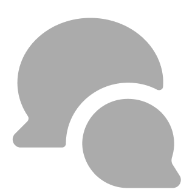

# Discord Transition Guide for [Your Forum Name] Members

## I. Introduction: Welcome to Discord!

### A. Bridging the Gap: Why Discord, and Why It Feels Different

The shift from the familiar threaded Chatty to Discord might feel a bit jarring at first. The Chatty was a place for static, organized discussion where conversations unfolded over time. Discord, on the other hand, is a more dynamic platform, originally designed for real-time communication among gamers. However, don't worry! Discord has evolved, and we can leverage a few of its features features to create a comfortable and engaging space that retains some of the best aspects of the chatty: Its community.

### B. Key Differences: Forum vs. Discord (High-Level)

Here's a quick rundown of some fundamental differences:

* **Real-time Chat () vs. Threaded Posts ():** Discord's core is real-time chat, which can feel faster-paced than our forum's slower, threaded discussions. However, Discord also offers features like **threads** and **slow mode** to manage the flow of conversation and create focused discussions, similar to forum threads. We'll be exploring these options later on in this guide.
* **Always-on Presence vs. Asynchronous Participation:** Discord shows who's currently online, fostering a sense of immediacy. On the forum, we were used to participating asynchronously, replying whenever we had time. On Discord, you can still participate at your own pace, but you'll also have the option to engage in live conversations. Managing your online status and notifications will be essential and learning how to adjust them to fit your wants is key to not getting annoyed at the format.
* **Notifications:** Discord's notifications can be much more frequent than anything we're used to with the Chatty. Any user can tag any other user and prompt a notification to show. Furthermore, you can have assigned roles that you always get prompted for such as the #StarCitizen or #Sports which can also prompt for a notification.

### C. This Guide's Goal

This guide aims to:

1. Help you maintain a sense of the chatty community within Discord as much as possible.
2. Introduce and explain Discord features that enhance community building and help keep information as static as possible.
3. Provide you with an easy-to-check guide to Discord features that you might not know about.

## II. Getting Started: The Basics of Discord

### A. Setting Up Discord

#### Desktop Setup

1. Download the installer for your operating system from [https://discord.com/download](https://discord.com/download).
2. Run the installer & follow the setup instructions for [Windows](https://support.discord.com/hc/en-us/articles/360034561191-Desktop-Installation-Guide#h_01HD1PCA2S1V6J8M981210BZCS), [macOS](https://support.discord.com/hc/en-us/articles/360034561191-Desktop-Installation-Guide#h_01HD1PCA2SSG11NPMD4W1NY2Y6), or [Linux](https://support.discord.com/hc/en-us/articles/360034561191-Desktop-Installation-Guide#h_01HD1PCA2SYG455Z4B4E0HWRB1).

#### Mobile Setup

Download the "_Discord_" app from the [App Store (iOS)](https://apps.apple.com/us/app/discord-talk-play-hang-out/id985746746) or [Google Play Store (Android)](https://play.google.com/store/apps/details?id=com.discord).

#### Browser Setup

In a browser tab, go to <https://discord.com/login>.
   
### B. Creating an Account and Joining the Server

1. **Creating an Account:**
    * Open the Discord app or go to <https://discord.com/login> in your browser.
    * Click "_Register_" or "_Open Discord in your browser_".
    * Enter your email, choose a username (please use something recognizable from the forum if possible), create a password, & provide your date of birth.
    * Verify your email address.
2. **Joining the Server:**
    * Go to <https://discord.gg/thechatty> in your browser & you'll be prompted to join the server.
    * Alternatively, you can open Discord, click the `+` icon in the server list (left sidebar), choose "_Join a Server_", & paste the invite link.

### C. Discord Interface: A Quick Tour

#### Desktop

* **Server Sidebar:** The leftmost sidebar displays the servers you've joined. You can switch between servers by clicking their icons. The icons can also be rearranged as you see fit, or placed into folders. We recommend moving Chatty@Home or even not joining another server at all.

* **Channel List:**  The next sidebar to the right shows the channels within the current server. Channels are separated into Categories that function as collapsable dividers for better channel organization.
* 
* **Main Chat Area:** This is where messages are displayed for the selected channel both in chat mode and forums. Those familiar with IRC should find this very easy to navigate, though there is the addition of several features such as adding pictures, files, gifs and reactions.

* **Member List:** The rightmost sidebar shows the members of the server, their online status, and their roles (which we will cover in a future section).

* **Your Profile and Settings (Gear Icon):**  Located at the bottom of the server sidebar, next to your username. This is where you can personalize your profile, adjust your settings (including notifications!), and manage your privacy.

## III. Bastardizing the Chatty format with Discord

There are three different ways to chat with text in Discord:
   * Channels: 
   * Threads:  (in live chat) or  (in left navbar) <!--  -->
   * Forums: 

### A. Channels

Channels are both the enterance to every day chatrooms where information is presented in real time and also how you access threads, which are a by channel feature.

* **Organization:** Chatty@Home has several different categories (e.g., `SHACKER`, `FOOD, HEALTH & FITNESS`, `TECH`), each of which have channels dedicated to various topics (e.g., `#chatty` `#food-n-drink`, `#devdump`). Categories can be collapsed or expanded; toggling a channel will collapse or expand any channel & thread belonging to that category that contain no unread messages.
* **Pinned Messages:** Important information, rules, or announcements within a channel can be "pinned" to the top of the chat. Click the pin icon in the top right of a channel to view pinned messages.

* **Announcement Channels:** These special channels are used for important server-wide updates, much like the announcement section of our forum. Only designated roles (e.g., moderators) can post in announcement channels, but everyone can read them.

### B. Threads: Deeper Dives into Topics

Threads allow for focused discussions within a channel, a mini-breakout chat.

* **How to Start a Thread:**
  * Hover over a message you want to discuss further.
  * Click the "Create Thread" icon (it looks like a # with lines).
  * Give your thread a title.
  * Select how long the thread should remain active before auto-archiving.
* **Archiving Threads:** Threads can be automatically archived after a period of inactivity (e.g., 24 hours, 3 days). This helps to keep channels tidy, but archived threads can still be viewed and searched.
* **Subtopics within a Channel:** By using threads effectively, we can maintain organized conversations within a channel, making it feel more like a structured forum discussion.

### C. Forum Channels: Dedicated Spaces for Threaded Discussions

Discord offers a special type of channel called a **Forum Channel** that is designed to mimic the structure and feel of traditional online forums. While regular text channels and threads are used for live chatting, Forum Channels provide a more organized and visually distinct way to host multiple ongoing, threaded conversations.

**How Forum Channels Work:**

* **Organized Posts:** In a Forum Channel, each new topic is created as a separate "post," much like creating a new post on the chatty. These posts are displayed in a grid or list view, making it easy to browse different topics.
* **Dedicated Discussion Space:** When you click on a post in a Forum Channel, it opens into a dedicated space where you can read the original post and all the replies, similar to viewing a thread on a forum. This keeps the conversation focused and prevents it from getting lost in the main channel feed.
* **Tags and Sorting:** Forum Channels allow you to add tags to each post, making it easier to categorize and filter discussions. You can sort posts by recent activity, creation date, and other criteria.  You can also filter by whether a post has been resolved or not.
* **Clear Overview:** The layout of Forum Channels provides a clear overview of all the active discussions, making it easy to find topics that interest you and to see which posts have new replies.

### D. Finding Your Way: Navigation and Search

* **Channel Jumping (Ctrl+K or Cmd+K):** Quickly switch between channels by pressing `Ctrl+K` (Windows) or `Cmd+K` (Mac) and typing the channel name.
* **Search Functionality:** Discord's powerful search allows you to find specific messages, users, or files.
  * Use the search bar at the top right of the Discord window.
  * You can filter your search by channel, user, date, and other criteria by using search modifiers like `in:#channel-name` or `from:@username`.
* **Mentions (@username, @role):** To direct a message to a specific user or group, use the "@" symbol followed by their username or role (e.g., `@moderators`). This is comparable to quoting someone on the forum.

## IV. Communication and Interaction

### A. Text Chat: Writing and Formatting Messages

* **Basic Formatting:**
  * **Bold:** `**text**`
  * *Italics:* `*text*`
  * `Code`: \`\`\`code\`\`\`
* **Emojis and Reactions:**  Add emojis to your messages using the emoji picker (smiley face icon) or by typing a colon (`:`) followed by the emoji name. You can also react to messages with emojis by clicking the add reaction icon (smiley face with a plus).
* **Editing and Deleting Messages:** You can edit or delete your own messages by hovering over them and clicking the three dots (ellipsis) that appear.

### B. Replies: Directly responding to messages

* **How to reply:** Hover over the message you want to reply to and click the "reply" icon (arrow pointing to the left). You can also start typing a message and use the @ symbol to mention someone, which will then function as a reply to the message they last sent.
* **Why replies are important:** It helps keep the chat flowing logically and will prompt when a chat might be better off breaking out into a thread.

### C. Voice and Video Calls (Optional)

These exist. Use them if you'd like. All of it is optional.

* **Voice Channels:**  Our server may have voice channels where you can chat with others using your microphone.
* **Video Calls:** You can also make video calls within voice channels or direct messages.

## V. Managing Notifications and Staying Sane

### A. Understanding Notification Settings

* **Server-Level Settings:**
  * Right-click on the server icon in the server sidebar.
  * Go to "Notification Settings."
  * You can choose to receive notifications for:
        *   **All Messages:** You'll be notified about every message in every channel. (Not recommended for busy servers!)
        *   **Only @mentions:** You'll only be notified when someone specifically mentions your username or a role you belong to.
        *   **Nothing:** You won't receive any notifications from the server.
  * You can also choose to **mute** the entire server, which will prevent any notifications from coming through.
* **Channel-Level Settings:**
  * Right-click on a specific channel.
  * Go to "Notification Settings."
  * You can customize notification settings for individual channels, overriding the server-level settings. For example, you might mute a busy channel but still receive notifications for @mentions in a more important channel.
* **"Here" and "Everyone" Mentions:**
  * `@here` notifies all members of a channel who are currently online.
  * `@everyone` notifies every member of the server, regardless of their online status.
  * **Please use these mentions sparingly, as they can be disruptive.**

### B. Do Not Disturb Mode: Taking a Break

* Click on your profile picture at the bottom of the server sidebar.
* Select "Do Not Disturb." This will temporarily silence all Discord notifications.

### C. Managing Your Online Status

* Click on your profile picture.
* You can set your status to:
  * **Online:**  Indicates you're active and available.
  * **Idle:** Indicates you're away from your computer.
  * **Do Not Disturb:**  Silences notifications.
  * **Invisible:**  Appears offline to others but allows you to use Discord normally.
* **Custom Status:** You can also set a custom status message to let people know what you're up to (e.g., "Reading," "Away for lunch").

## VI. Tips, Tricks, and Etiquette

### A. Discord Etiquette

* **Be Respectful:** Treat others with the same courtesy and respect you would on our old forum.
* **Avoid Spamming:** Don't flood channels with unnecessary messages or repeat the same message multiple times.
* **Use Appropriate Channels:** Keep discussions relevant to the channel topic.
* **Use Mentions Sparingly:** Only use `@username`, `@here`, or `@everyone` when necessary.
* **Don't Be Afraid to Ask for Help:** If you're unsure about something, ask a moderator or another member for assistance.

## VII. Quick Reference Guide

### A. Glossary of Discord Terms

* **Channel:** A space for text or voice conversations, organized by topic.
* **Thread:** A sub-conversation within a channel, started from a specific message.
* **Mention:** Using "@" followed by a username or role to notify someone.
* **DM (Direct Message):** A private message between two users.
* **Role:** A set of permissions that can be assigned to users (e.g., moderator, member).
* **Server:** A community on Discord, made up of channels and members.
* **Slow Mode:** A channel setting that limits how often users can send messages.
* **Pinned Messages:** Messages that are "pinned" to the top of a channel for easy access.
* **Bot:** A program that performs automated tasks on Discord.

### B. Common Keyboard Shortcuts

* **Ctrl+K** or **Cmd+K:** Quick Switcher
* **Ctrl+/ or Cmd+/**: Show keyboard shortcuts
* **Esc:** Mark channel as read

### C. Notification Settings Cheat Sheet

* **Mute a Server:** Right-click server icon \> Notification Settings \> Mute [Server Name]
* **Mute a Channel:** Right-click channel name \> Mute Channel
* **Change Notification Sound:** User Settings (gear icon) \> Notifications \> Message Sound

### D. Troubleshooting Common Issues

* **Can't Hear Audio in Voice Channels:**
  * Check your audio input/output settings in User Settings \> Voice & Video.
  * Make sure you've selected the correct microphone and speakers.
* **Messages Not Sending:**
  * Check your internet connection.
  * Make sure you're not in a channel with slow mode enabled and have hit the time limit.
* **Discord App Crashing:**
  * Try restarting the app.
  * If that doesn't work, try reinstalling Discord.
