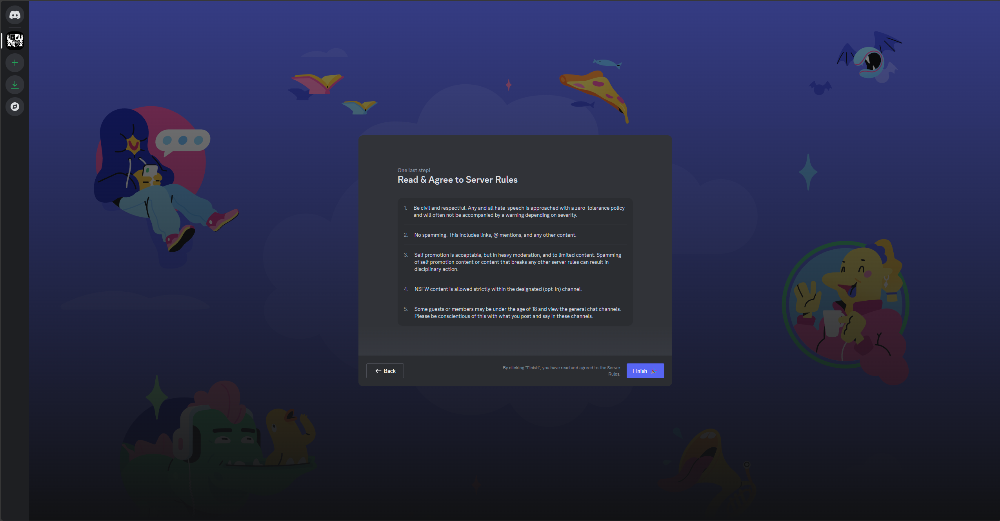

---
layout: page
title: Our Server's Onboarding Process
parent: Mastering Discord Features
nav_order: 2
---

# Onboarding for Chatty@Home

To help you get settled in, we have a simple three-step onboarding process. It's quick, easy, and designed to connect you with the things you're most interested in.

## Step 1: What Do You Want?

First, you'll be asked a simple question: **What do you want?**

This helps us understand why you're here. For now, you have one option:

*   **Stay Connected with the Chatty:** This option will get you to the areas in which other forum refugees congregate.
*   **I'm just looking around:** This is the perfect choice if you're coming from a game and have been asked to play or just want to explore the server at your own pace.

Select the option that best describes you **OR** select both of them for maximum channels and click "Next."

## Step 2: Were You Invited to Game Here?

Next, we'll ask if you were specifically invited to game with us.

This is where you can select roles related to specific games. Roles help us organize members with similar interests and give you access to dedicated channels.

*   **Minecraft:** Choose this role if you're interested in our Minecraft community.
*   **Destiny 2:** Choose this role if you're a Destiny 2 player.
*   **Star Citizen:** Choose this role if you play or are interested in Star Citizen.

You can select one, two, or all three roles. If you aren't interested in any of these games, simply click "Skip" to move on.

## Step 3: Read and Agree to the Server Rules

Finally, you'll be presented with our server rules.

*   **Please Read Carefully:** These rules are in place to ensure a positive, respectful, and enjoyable experience for everyone. Take your time to read through them.
*   **Agree to Continue:** Once you've read the rules, check the box indicating that you agree and click "Submit."

## You're In!
