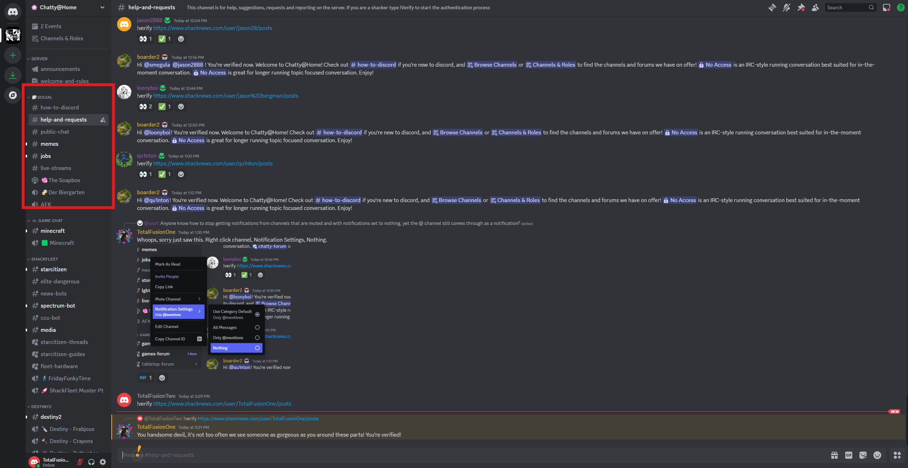
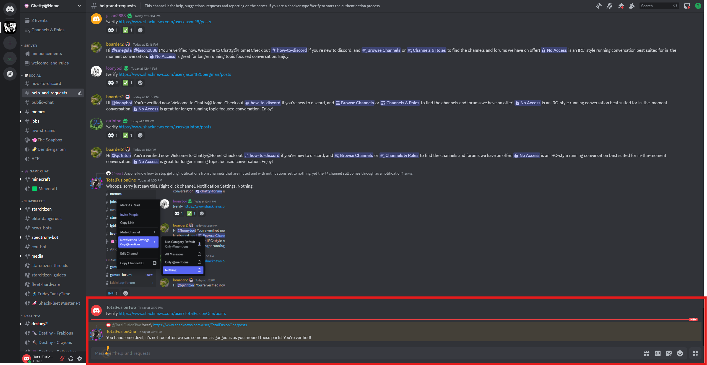

# Verification for Returning Forum Members

Welcome back! If you were a member of our previous forum community, we'd love to verify your identity so you can reconnect with old friends and maintain your established reputation.

## Why Verify?

Verifying your account helps us:

*   **Maintain a Trusted Community:** It ensures that returning members are who they say they are.
*   **Reconnect with Friends:** It helps you find and reconnect with members you knew from the old forum.
*   **Carry Over Your Reputation:** But not your LoL tags.

## How to Verify

1.  **Head to `#help-and-requests`:** Once you've completed the initial onboarding, navigate to the `#help-and-requests` channel. This is where you'll submit your verification request.

    

2.  **Use the `!verify` Command:** In the `#help-and-requests` channel, type the command `!verify` followed by the link to your old forum profile, **all in one message**.

    **Example:**  `!verify https://www.shacknews.com/user/TotalFusionOne/posts`

    

3.  **Submit Your Profile Link:**  Make sure the link is to your public profile page on our old forum. Send the message containing the `!verify` command and your link.

4.  **Wait for Confirmation:** Our moderators will review your submission and verify your account. This process may take some time, so please be patient. Once your account is verified, you'll receive a notification and may be granted a special role.

## What if I Can't Find My Old Profile Link?

If you're having trouble locating your old forum profile link, don't worry! Just type a message in `#help-and-requests` explaining the situation, and one of our moderators will assist you.

We appreciate you taking the time to verify your account. It helps us build a stronger and more connected community here on Discord!