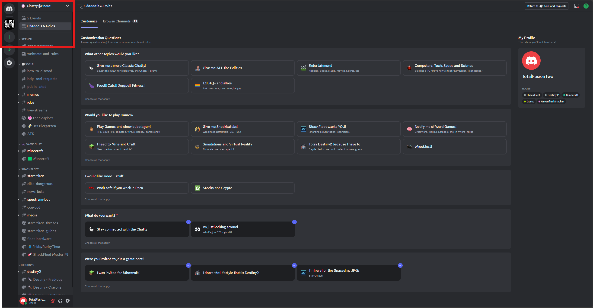
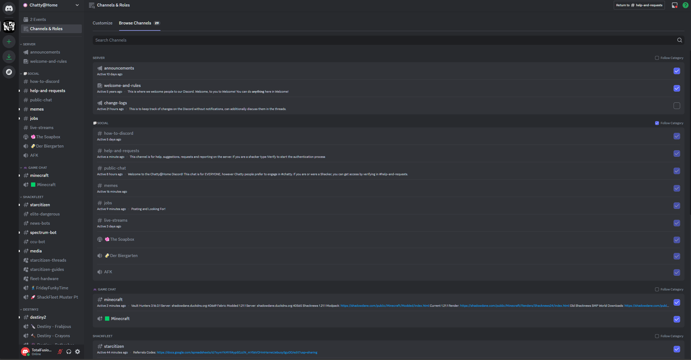
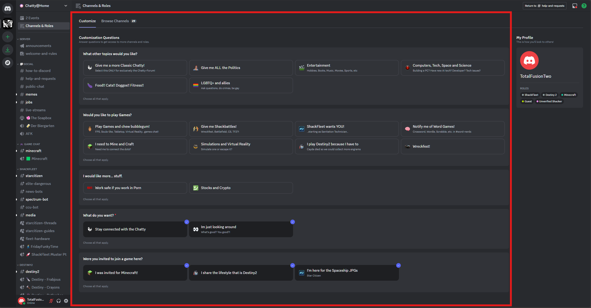

# Adding Channels to Your View: Customize Your Discord Experience

Discord offers a lot of flexibility in choosing which channels you see and participate in. This is especially helpful 
in larger servers like ours, where there might be many channels covering a wide range of topics.  
Here's how you can add channels to your view using two different methods: the **Channels & Roles** 
screen and the **Browse Channels** screen.

## Using the Channels & Roles Screen

The "Channels & Roles" screen provides a centralized location to manage the channels you've joined and discover new ones.

1.  **Access the Screen:**
    *   Click on Channels and Roles at the top of the Channel list

    

2.  **Browse Available Channels:**
    *   The "Channels" tab lists all the channels you currently have access to. Channels that you have not joined will have an empty checkbox next to them.
    *   Click on the checkbox to add the channel to your channel list.

    

3.  **Customize Roles (Optional):**
    *   The "Roles" tab allows you to opt-in or opt-out of available roles, which might grant you access to additional channels.
    *   This list will be similar to the one you saw on the Onboarding screen.

    

## Leaving Channels (without saying goodbye)

If you want to leave a channel the easiest way is to use the Browse Available Channel screen and uncheck the box next 
to the channel you want to leave.

