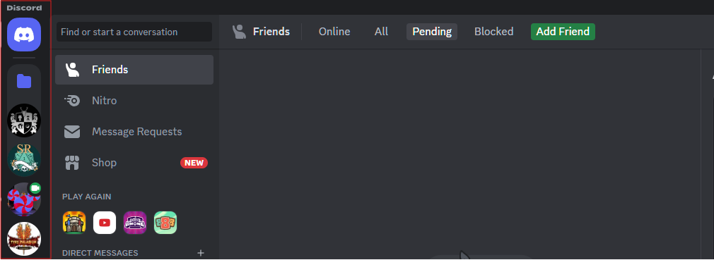
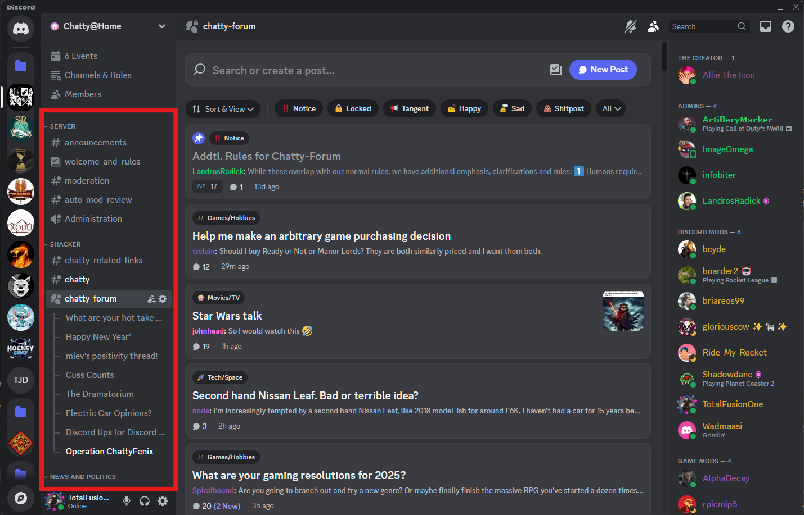
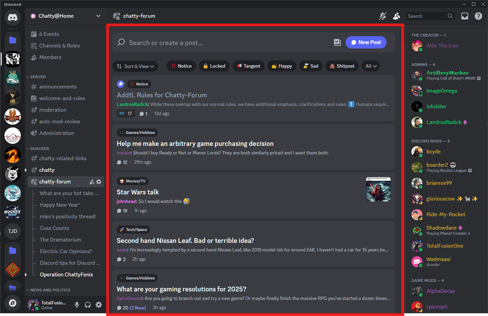
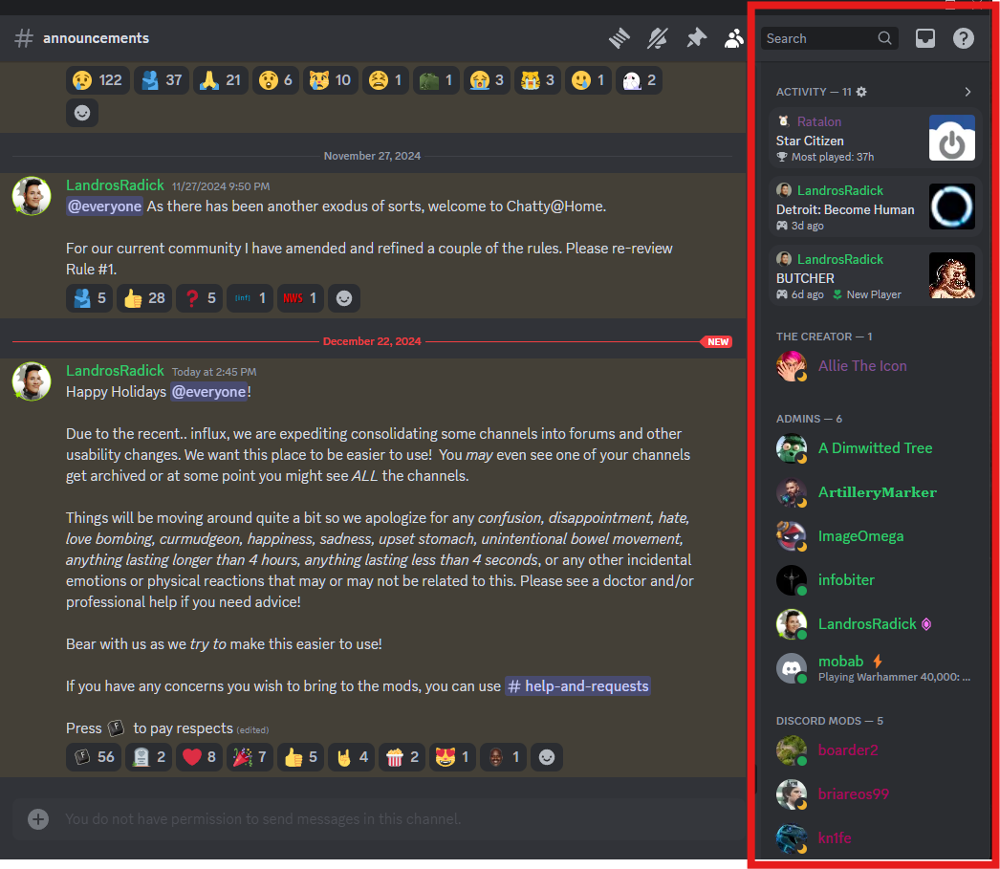
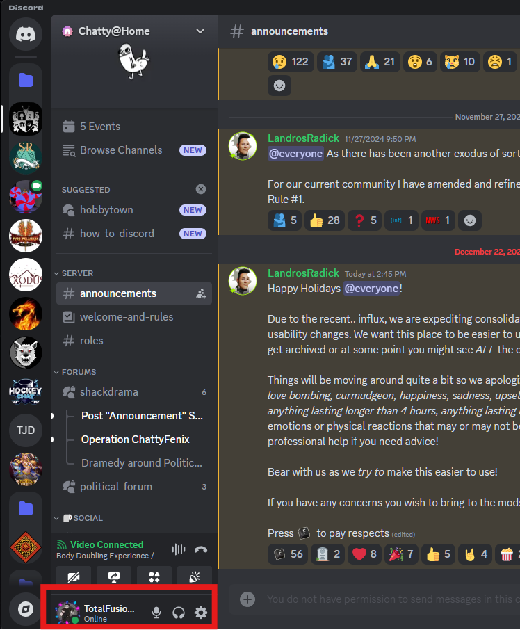

## Discord Interface: A Quick Tour

### Desktop

*   **Server Sidebar:** The leftmost sidebar displays the servers you've joined. You can switch between servers by clicking their icons. The icons can also be rearranged as you see fit, or placed into folders. We recommend moving Chatty@Home or even not joining another server at all.
    
*   **Channel List:** The next sidebar to the right shows the channels within the current server. Channels are separated into Categories that function as collapsable dividers for better channel organization.
    
*   **Main Chat Area:** This is where messages are displayed for the selected channel both in chat mode and forums. Those familiar with IRC should find this very easy to navigate, though there is the addition of several features such as adding pictures, files, gifs and reactions.
    
*   **Member List:** The rightmost sidebar shows the members of the server, their online status, and their roles (which we will cover in a future section).
    
*   **Your Profile and Settings (Gear Icon):** Located at the bottom of the server sidebar, next to your username. This is where you can personalize your profile, adjust your settings (including notifications!), and manage your privacy.
    