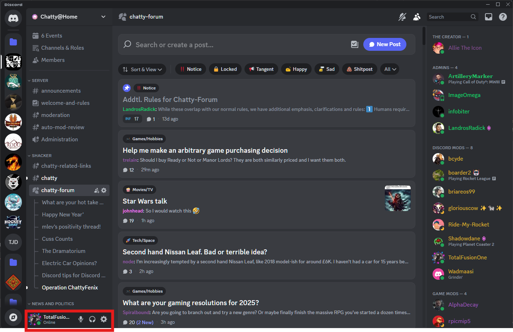

## Discord Interface: A Quick Tour

### Desktop

*   **Server Sidebar:** The leftmost sidebar displays the servers you've joined. You can switch between servers by clicking their icons. The icons can also be rearranged as you see fit or placed into folders. We recommend moving Chatty@Home to the top or even not joining other servers to minimize distractions.
    <figure>
      
      <figcaption>Fig. 1 - Discord Server Sidebar: Your list of joined servers.</figcaption>
    </figure>

*   **Channel List:** The next sidebar to the right shows the channels within the current server. Channels are separated into Categories that function as collapsible dividers for better channel organization.
    <figure>
      
      <figcaption>Fig. 2 - Discord Channel List: Channels within the selected server.</figcaption>
    </figure>

*   **Main Chat Area:** This is where messages are displayed for the selected channel, both in chat mode and forums. Those familiar with IRC should find this very easy to navigate, though there are additional features such as adding pictures, files, GIFs, and reactions.
    <figure>
      
      <figcaption>Fig. 3 - Main Chat Area: The primary area for viewing and sending messages.</figcaption>
    </figure>

*   **Member List:** The rightmost sidebar shows the members of the server, their online status, and their roles (which we will cover in a future section).
    <figure>
      
      <figcaption>Fig. 4 - Member List: Online status and roles of server members.</figcaption>
    </figure>

*   **Your Profile and Settings (Gear Icon):** Located at the bottom of the server sidebar, next to your username. This is where you can personalize your profile, adjust your settings (including notifications!), and manage your privacy.
    <figure>
      
      <figcaption>Fig. 5 - Profile and Settings: Access your user settings and profile customization.</figcaption>
    </figure>